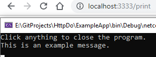
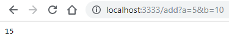
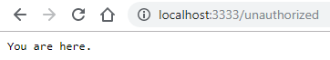
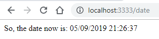

# HttpDo

**HttpDo** is a robust yet easy to install and use nuget package.

It provides you with means neccessary to create a remotely accessible app.


Despite being lightweight, it also comes with sessions, templating engine, error handling, routing, easy authorization and more!


Below you'll find a list of topics that'll put you up to speed with the plugin.

**Table of Contents:**

[TOC]


## Features

Here's a list of most (if not all) features contained within the package:

- **Sessions**

  Provides means of transfering data between pages and requests.

- **Templating Engine**

  Allows you to display output of code on pages returned by the server.

- **Error Handling**

  Because HTTP error codes can't explain C# exceptions.

- **Routing**

  Thanks to routing, you don't have to write 'MyVeryLengthyMethodHere' in the browser. 

- **Easy Authorization**

  By default, every request runs through `HasAccess()` and `HasFileAccess()` methods - which can be overriden to fit needs.

- **More..**

  Other features include: `FormData` container, proper navigation via `Response` class and so on..

  

## Getting Started

**Step 1 - Download & Install**

To install the package, simply find it in your Nuget Package Browser then click 'Install'.


.. or click the link below.

[link](link)


.. or paste the lines below to your Package Manager Console.

`code`

<hr>

**Step 2 - Start Service**

To start the service, simply put the code below somewhere in the program where you find it fit.	

```csharp
var handler = new HttpHandler("http://localhost:3333", "HttpDo");
```

The first parameter is `rootUrl` and it defines under which URL the connection will be available.

The second parameter is `rootPath` which defines path to folder containing `index.html` and other files that you might be navigating to.


**Hint: **It's highly advices to declare handler as a public property accessible from outside the scope.

<hr>

**Step 3 - Hook Methods**

To hook a method to a route, simply add one of two attributes above it - `[HttpGet]` or `[HttpPost]`.

The first parameter of the attribute is essential, because it defines under which URL the method will be available.


Here's an example of hooking:

```csharp
[HttpGet("print")]
public static void Print() => Console.WriteLine("This is an example message.");
```


If you've hooked it properly, navigating to `http://localhost:3333/print` should pop a message in the console.


.. and there it is:




## Routing

The built-in routing system follows few strict rules:

- POST requests can't lead to files.
- If the URL ends with an extension, routing will look for a file.
- If the URL has no extension, routing will look for a method to call.
- If the URL has no extension and there's no method to call, it'll append `.html` and look for a file.

Follow them and you won't have any issues.


## Return Values

You can return values from both **GET** and **POST** requests, as long as the return value is of a type that's convertible to string.

String is a prefered type of the HTTP protocol due to xml, json and other string-based formats.

Usually conversion between non-standard types is done via `ToString()`.


Here's an example on how to return data after a request:

```csharp
[HttpGet("getdate")]
public static string GetDate() => DateTime.Now.ToString();
```


Surely enough, the result we get is:


**Note: ** HttpDo is api-ready. All you need is some asynchronous javascript and you can make the clock refresh in real time.


## Call with Params

The plugin comes with a system for processing raw request data into method parameters if need be.


In order for method to be executed, the default C# rules still apply:

- If param is nullable and has no value set - we good.

- If param has default value and isn't being set - we good.

- If param isn't optional and isn't being set - you'll get one of these red headaches:

  


Now, here's an example on how to accomplish such a thing with a GET request:

```csharp
[HttpGet("add")]
public static int Add(int a, int b) => a + b;
```


.. and here's the result:



<hr>

Here's an example on how to accomplish the same thing with a POST request:

```csharp
[HttpPost("add")]
public static int Add(int a, int b) => a + b;
```

As you can see, the declaration is almost identical.


.. but what we also need, is a HTML form:

```html
<form action="/add" method="post">
	<input type="number" name="a"/>
	<input type="number" name="b"/>
	<input type="submit"/>
</form>
```


.. yet again, here's the result of `a=54` + `b=6`:


## FormData Container

Performing POST requests is easy, but sometimes you want to handle multiple forms of different inputs using a single route.

All you need to do so is use `FormData` container.


Here's how:

```csharp
[HttpPost("contact")]
public static void Contact(FormData form) => Console.Write(form["message"]);

// message refers to input of name 'message'
```


**Hint:** Using `FormData` doesn't mean that you can't have more parameters, it's just obsolete to have: `FormData form, int someInput` because `someInput` is already accessible via `form["someInput"]`.


## Sessions

The plugin comes with a way to transfer data between pages.

Sessions are used across the entire system, especially the **Templating Engine**.


Storing and retrieving data from sessions is as simple as this:

```csharp
Handler.GetSession()["key"] = value; // assign
Handler.GetSession()["key"]; // retrieve
```


## Redirecting

Redirecting is a fairly simple thing in HttpDo.

If your method is meant to redirect back after it's done working it's magic, simply declare it's return type as `Response` and within the constructor define the route you want it to navigate to.


Here's an example:

```csharp
[HttpGet("redirect")]
public static Response Redirector() => new Response("");
```


## Authorization

Some pages and routes shouldn't be publicly available to unauthorized users.

If you haven't noticed yet, the `HttpGet` and `HttpPost` have an extra parameter called `secure`.

The said parameter indicates whether or not requests will execute `HasAccess()` and `HasFileAccess()` before letting the request to go through.


To explain this in a pragmatic way, let's say you have a method as such:

```csharp
[HttpGet("securemethod", true)] // true means secure = true
public static string SecureMethod() => "You are here.";
```


By default `HasAccess()` checks if session variable called `is_authorized` was set.

By default `HasFileAccess()` checks if session the same session variable is set, but also checks if the file has `.html` extension.


If you try accessing the page without the session variable being set, you'll get this message:


.. now, let's say we go through the method below and back:

```csharp
[HttpGet("authorize")]
public static void Authorize() => Handler.GetSession()["is_authorized"] = true;
```


.. the result would be far different:



**Hint: ** You can create a page for authorization that requires a secret key, login, password etc.


## Custom Authorization

You can define your own access conditions easily.

To do so, simply inherit from the `HttpHandler` class and override the following methods:

- HasAccess
- HasFileAccess


Here's an example:

```csharp
public class HttpService : HttpHandler
{
	public HttpService(string rootUrl, string rootPath) : base(rootUrl, rootPath) { }

	protected override bool HasAccess() => GetSession()["login"];

	protected override bool HasFileAccess(string path) 
    	=> Path.GetExtension(path) == ".html" 
        || Path.GetDirectoryName(path) == "downloadables";
}
```

Easy enough? I should hope so :)


## Templating Engine

Finally, my favourite feature.

Templating Engine parses your html files before they go through, replacing `@{{ code }}` with the result of the said code.


It's also important to mention that **it has full access to session** - which should be your primary source of computed data.


Here's an example how to use it:

```html
<html>
	<head>
		<meta>
		<title>Sample Page</title>
	</head>
	<body>
		So, the date now is: @{{ Session["date"] ?? "Dunno.." }}
	</body>
</html>

```


.. and here's the result:




**Remember:** Session in this case is available under `Session` not `Handler.GetSession()`.


## To-Do's

- Allow returning views (html files) in GET requests.

